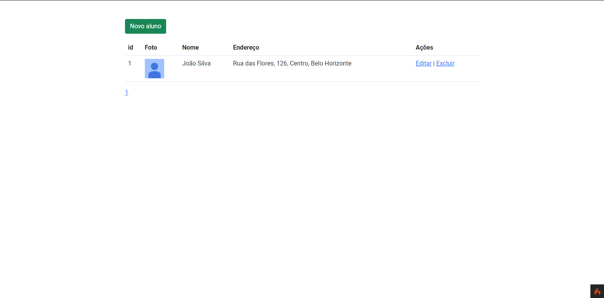

# desafio-delta-global
Desafio da Delta Global

## Instalação

Tenha o composer instalado, é necessario atualizar o ambiente antes da execução, para isso na pasta raiz, execute no terminal, um dos comandos:

```
composer install
composer update
```
Após estes comando, configure um banco de dados no arquivo .env

###  Windows

Para Windows o aplicativo XAMPP é uma alternativa extremamente fácil e de configuração rápida, mas para o bom funcionamento é importante habilitar a extensão 'intl', localizada na pasta C:/xampp/php/php.ini ou pelo próprio aplicativo é possivel habilitá-la.

Após configurar totalmente, é só apertar o 'Start' para o Apache e o MySQL.

### Linux

Para o Ubuntu é necessário configurar manualmente o ambiente e na pasta raiz do projeto subir o servidor via CLI através do comando:
```
php spark serve
```

    
Por fim, para iniciarmos execute os comandos em ordem:
```
php spark migrate
php spark db:seed AlunosSeeder
```
Inicie a aplicação
    
Acesse em http://localhost
    
Você provavelmente verá uma tela assim!

